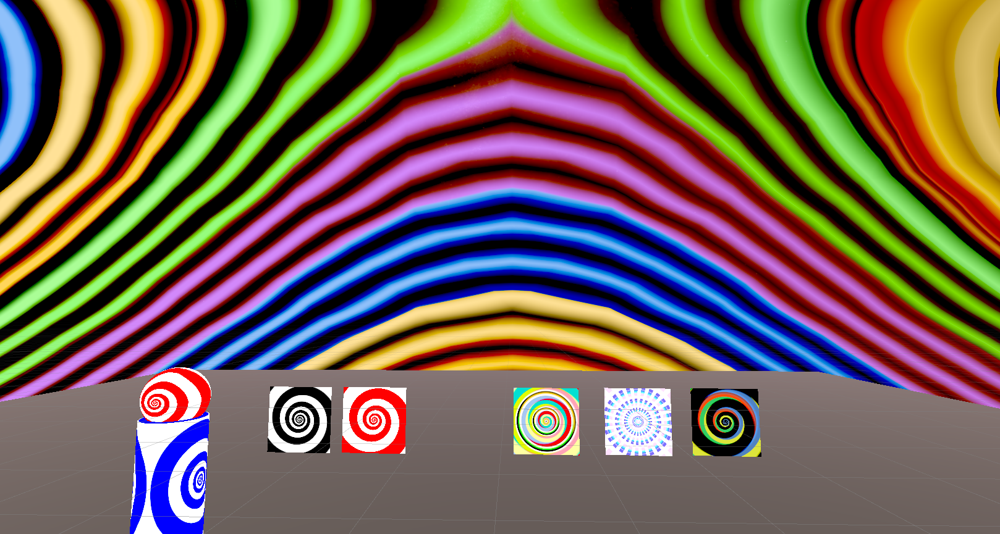

# swirlies-shader

Customizable spiral shader that you can use for your eyes, glasses, skybox, etc.
UV Projection based off following bgolus article: https://bgolus.medium.com/distinctive-derivative-differences-cce38d36797b#85c9 
Uses MIT License.

Gradients: https://paletton.com/

Skyboxes

Hellstormde: https://www.deviantart.com/hellstormde/art/Milky-Way-Galaxy-Global-Spherical-Map-342068552 (https://creativecommons.org/licenses/by-sa/3.0/)

darth-biomech: https://www.deviantart.com/darth-biomech/art/MilkyWay-galaxy-sphere-map-8k-746133328 (https://creativecommons.org/licenses/by-sa/3.0/)

Repo: https://github.com/cutesthypnotist/swirlies-shader